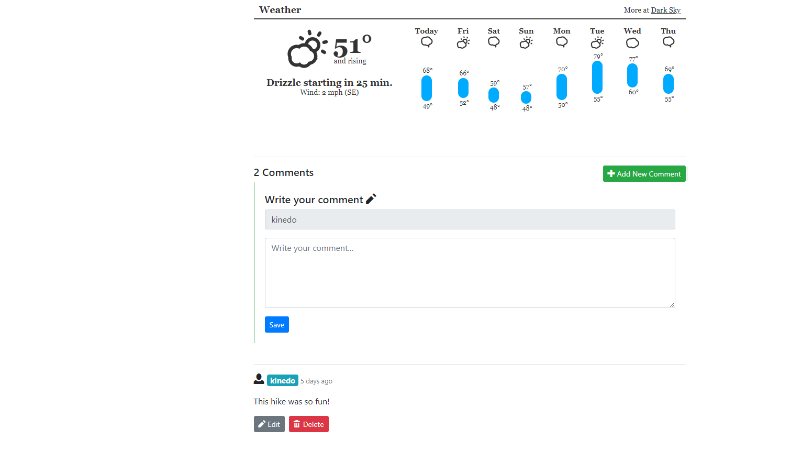

# HikingTrails

[HikingTrails](http://quiet-springs-70745.herokuapp.com/)

HikingTrails is a social media platform for sharing and rating hiking trails. It utilizes Express and Node.js on the backend with a MongoDB database and Pug as the templating engine.

## Features

### Profile - Cover Photo & Google Maps

Users can submit hiking trail infromation including the name, location, duration, difficulty, etc. User's can also upload a related picture as a cover photo for the post.

The location information is then used with the Google Maps API to display an interactive map showing the location of the trail.

### Profile - Weather & Comments

Weather information is dynamically displayed using forecast.io based on longitude and latitude data. Longitude and latitude information is retrieved from the Google Maps API where it is stored in the backend with the related trail.

Users can comment on hiking trails posts and you can delete the post if you are the author.

Users

### Profile

For the profile, I render a pull of all the users posted trails. Users will also be able to edit their profiles if it is their own profile.

### Password Reset

Password reset is available, implemented with a link that is sent to your email address with a secret token that expires in one hour.

### Built with

* [Express](http://expressjs.com/) - Fast, unopinionated, minimalist web framework for Node.js.
* [MongoDB](https://www.mongodb.com/) - Document database with the scalability and flexibility that you want with the querying and indexing that you need.
* [Bootstrap](http://getbootstrap.com/) - Extensive list of components and bundled Javascript plugins.
* [Pug](https://github.com/pugjs/pug/) - Template engine heavily influenced by Haml and implemented with JavaScript for Node.js and browsers.

### To-do

* Add rating capability to posts.
* Add like capability to comments.
